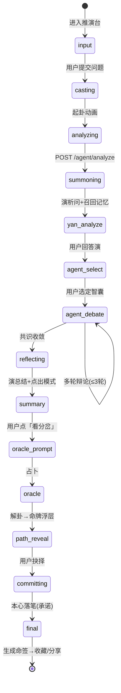
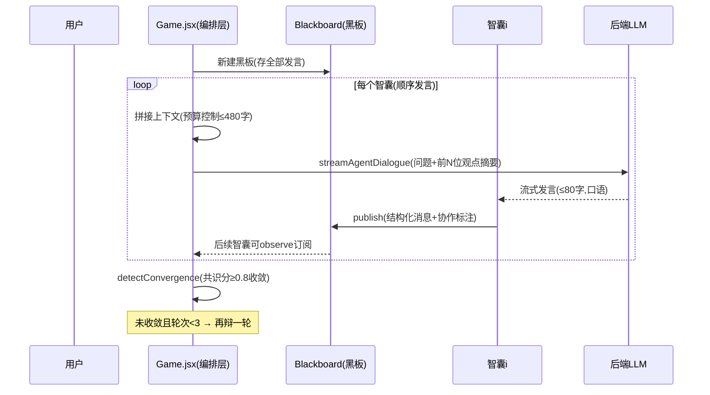
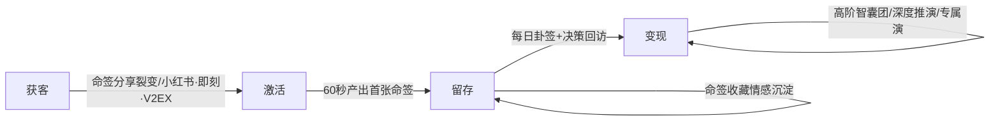
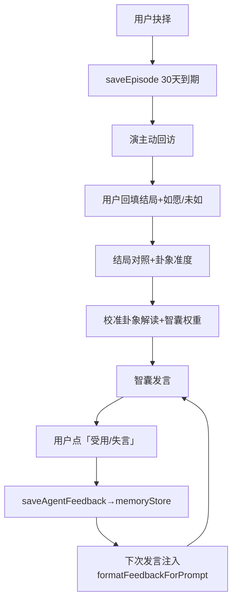

# 演策 · Agent 设计与商业蓝图（单一权威文档）

> 定位：这是项目唯一的「Agent 架构 + 商业蓝图」权威文档。
> 所有 prompt/配置/工作流/商业决策以此为准。代码是事实，本文档是地图。
> 更新纪律：改任何 Agent 行为/prompt/工作流 → 先改本文档，再改代码。

---

## 0. 一页速览（30 秒看懂全貌）

**一句话产品**：演策 = AI 决策推演沙盘。用户抛出真实纠结 → 演（主 Agent）析问 → 召唤多视角智囊辩论 → 占卜立卦 → 用户抉择 → 生成可收藏可分享的命签。

**核心壁垒（不可抄袭点）**：
1. 复合 Agent 系统（不是 prompt 调用，是编排精良的 Harness）
2. 决策数据飞轮（命签 + 30天回访 + 结局对照 → 越用越懂用户）
3. 情感切换成本（命签收藏 = 决策档案，越久越不愿离开）

**商业北极星**：**让用户在「人生重要决策前，先想到来演策起一卦」**。
获客靠命签分享裂变，留存靠每日卦签 + 决策回顾闭环，变现靠高阶智囊团/深度推演订阅。

---

## 1. Agent 工作流 · 可视化（内部运转地图）

### 1.1 主状态机（Game.jsx，11 个阶段）



### 1.2 智囊辩论时序（多 Agent 协作核心）



### 1.3 三层提示词结构（每个智囊的灵魂）

```
【identity 身份锚定】persona（20年CFO/心理咨询师…）→ 让LLM成为"这个人"
【methodology 工作方法】先看账/先问感受/先泼冷水… → 决定"怎么想"
【deliverable 交付标准】1-3句≤80字/口语/抓具体词/可反问可泼冷水 → 决定"怎么输出"
```

> **权威源在后端** `server/src/data/agentPool.js` 的 `buildAgentSystemPrompt`（三层结构 identity/methodology/deliverable）。
> 前端 `src/services/inferenceEngine.js` 的 `AGENT_PERSONAS` 只做本地降级（后端不可达时用），persona 字段需与后端同步（已同步 12 个智囊，见 §5 技术债 P0 已完成）。

---

## 2. 五大视角全景（产品 / 技术 / 设计 / 策划 / 运营）

### 2.1 产品视角 —— 用户价值与路径

| 维度 | 现状 | 完美态（目标） |
|------|------|----------------|
| 核心价值 | 决策时获得多视角分析 | 决策前「必来起一卦」的心智占位 |
| 首次体验 | 引导→输入→推演 | ≤60秒产出第一张可分享命签（惊艳点=智囊辩论真实感）|
| 留存钩子 | 每日卦签+命签收藏 | +30天回访闭环「你当时选的，结果如何？」|
| 情感连接 | 命签可收藏 | 命签=「决策编年史」，可回看推演路径 |

**用户画像**：25-40岁，面临职业/情感/投资重大决策，理性但犹豫，需要"被多角度点醒"而非"被告知答案"。

### 2.2 技术视角 —— 架构与护城河

**核心架构判断**：**Harness（编排）> 模型**。同一 GLM-4-Flash 在精良编排下远胜裸调。我们的钱花在编排，不是换更强 LLM。

| 层 | 现状 | 完美态 |
|----|------|--------|
| 编排层 | Game.jsx 状态机硬编码推进 | 状态机不变，但每阶段可观测（埋点）|
| 协作层 | Blackboard 单向订阅（伪协作）| 真消息传递：智囊可互相@反驳追问 |
| 记忆层 | 4层记忆(working/facts/episodes/semantic)已落地 localStorage | +云端同步(已登录用户)+向量召回 |
| 工具层 | ❌ 无工具调用 | 智囊可查搜索/日历/股价（真Agent标志）|
| 收敛层 | Wald SPRT 3信号(轮次/共识分/循环检测) | 保持，已够用 |

**技术护城河排序**：①决策数据飞轮 ②复合编排复杂度 ③卦象解读知识库 ④社区智囊生态。

### 2.3 设计视角 —— 体验与情绪

**设计语言**：水墨八卦虚空（底 #FAF8F0）× 纪念碑谷极简几何 × 符文神秘感。
**铁律**：动效克制（0.8-1.5s 缓入缓出，无弹跳/爆炸/震屏）；水墨留白；传统色（水墨灰/宣纸白，点缀朱砂红/石青绿/赭石黄/黛紫）。

| 触点 | 情绪设计 | 现状 |
|------|----------|------|
| 首次引导 | 全屏暗化→暖金光束→「演」字浮现→八卦圆周 | ✅ 已有 |
| 智囊发言 | 上浮+头顶纯浮动文字（无气泡框），4.5s自动消失 | ✅ 已有 |
| 立卦 | 三枚铜钱水墨翻滚1.5s→呼吸 | ✅ 已有 |
| 命签 | 朱砂方印+宣纸+水墨斑驳，可翻卦可分享PNG | ✅ 本轮新增 |
| 回看 | 推演路径模态（问题→批注→抉择→总结→卦辞→四柱→承诺→终局）| ✅ 本轮新增 |

### 2.4 策划视角 —— 玩法与内容运营

**玩法矩阵**：
- **核心玩法**：多智囊辩论推演（已上线）
- **日活玩法**：每日卦签（日期hash固定一卦）+ 连续签到
- **深度玩法**：决策回顾闭环（30天回访+结局对照+卦象准度%）
- **社区玩法**：智囊市集（发布/订阅他人智囊）→ UGC生态
- **成就系统**：6级（初入卦门→大衍之数），推演次数驱动

**内容运营**：卦象解读库 + 决策案例库持续沉淀；智囊「调校迭代」让高频智囊越用越准。

### 2.5 运营视角 —— 获客·留存·变现



| 阶段 | 策略 | 指标 |
|------|------|------|
| 获客 | 命签PNG自带「演策」水印，分享即获客；决策话题（辞职/创业/Offer）天然传播 | 分享率、新客来源 |
| 激活 | 首次60秒出命签，惊艳点=智囊辩论真实感 | 首签完成率 |
| 留存 | 每日卦签签到 + 30天回访推送 + 命签回看 | D1/D7/D30留存 |
| 变现 | 免费3智囊/次；订阅解锁全智囊团+深度推演+无限命签+演专属记忆 | 付费转化、ARPU |

---

## 3. 商业与社会价值（真正的命）

### 3.1 商业价值
- **不是"算命玩具"，是"决策辅助工具"**：切入「决策焦虑」这个高频刚需（职业/情感/投资/城市）。
- **变现路径**：免费增值（Freemium）。基础推演免费建立习惯；高阶智囊团、无限推演、深度报告、演专属长期记忆做订阅。
- **数据资产**：匿名化的「决策类型 × 选择倾向 × 实际结局」数据集 → 决策科学洞察（长期最值钱）。

### 3.2 社会价值
- **决策平权**：普通人也能获得"董事会式多视角推演"，不再是精英专属。
- **决策复盘文化**：30天回访闭环让"拍脑袋决策"变成"可回顾可学习的决策"，提升社会整体决策质量。
- **AI 向善标识**：全站「AI生成内容，仅供参考」+ 免责声明，明确工具定位不替代人决策。

---

## 4. 模块设计 · 流转 · 改进纠错机制

### 4.1 配置中心（prompt/变量单一来源 —— 解决"我不清楚的"）
> 目标：所有 prompt/persona/阈值集中在本文档 + 一个配置文件，改一处生效。

| 配置项 | 当前位置 | 应收敛到 |
|--------|----------|----------|
| 智囊 persona（三层） | 前端 `inferenceEngine.js` AGENT_PERSONAS + 后端 `agentPool.js` | **后端单一来源**，前端只读 |
| 发言交付标准（≤80字口语） | 后端 `agent.js` systemPrompt | 后端 `agent.js` 统一 |
| 上下文预算（≤480字） | 前端 `inferenceEngine.js` MAX_Q | 前端常量+后端校验对齐 |
| 收敛阈值（共识分0.8/轮次3） | 前端 Game.jsx + multiAgentFramework | `multiAgentFramework.js` 单一 |
| 记忆层上限（working10/facts30/episodes50）| `memoryStore.js` | 保持，已收敛 |

### 4.2 改进与纠错闭环（数据飞轮引擎）



**纠错三机制**：
1. **即时纠错**：失言反馈 → 下次发言自动微调（已实现）
2. **周期纠错**：30天结局回访 → 校准卦象准度（已实现）
3. **模式纠错**：detectChoicePattern 检测连续选择倾向 ≥3次 → 演主动点出"你总在稳守/逃避"（已实现）

### 4.3 观测与质量（上线后必做）
- 埋点：首签完成率 / 辩论LLM成功率 / 400错误率 / 分享率 / 回访回填率
- 告警：LLM 调用失败率 >20% 告警；400「问题过长」应 → 0（本轮已修）
- 降级：所有 LLM 调用必须有本地模板兜底（已实现，永远不能白屏/卡死）

---

## 5. 技术债与下一步（优先级排序）

| 优先级 | 事项 | 价值 | 状态 |
|--------|------|------|------|
| P0 | persona/prompt 前后端统一收敛到后端 | 改 prompt 只改一处，防不一致 | ✅ 已完成（2026-07-27）|
| P1 | 智囊工具调用（搜索/日历）→ 真Agent | 最大技术壁垒跃迁 | 待办 |
| P1 | 上线埋点 + 错误率告警 | 数据驱动迭代的前提 | 待办 |
| P2 | 记忆云端同步（已登录用户）| 跨设备留存 | 待办 |
| P2 | 社区智囊生态打磨（市集推荐位）| UGC 护城河 | 待办 |
| P3 | Bundle 压缩（vendor-three 已分包，可再懒加载）| 首屏速度 | 待办 |

### P0 完成说明（2026-07-27）
- 后端 `server/src/data/agentPool.js` 为权威源（12 个智囊，含三层提示词 identity/methodology/deliverable + persona 向后兼容字段）
- 前端 `src/services/inferenceEngine.js` 的 `AGENT_PERSONAS` 同步为后端 persona 字段副本（12 个智囊全部同步），标注"降级用，权威源在后端"
- 后端调用 LLM 时走 `buildAgentSystemPrompt`（三层结构），前端降级时走 `AGENT_PERSONAS[id].persona`
- 同步方法：改后端 `agentPool.js` 的 persona 字段后，复制到前端 `AGENT_PERSONAS` 对应条目

---

## 6. 给未来的我（架构决策记录 ADR）

> 每次重大决策记一条，避免"为什么要这么做"失传。

- **ADR-001**：Harness 优先于模型。不换更强 LLM，把编排做厚。理由：同模型在精良编排下远胜裸调。
- **ADR-002**：上下文预算控制在前端。后端 500 字校验是最后防线，前端主动截断保体验。理由：本地可测、不依赖后端部署。
- **ADR-003**：本地降级永远兜底。任何 LLM 失败都必须有模板/规则降级，永不白屏。理由：体验稳定 > 内容完美。
- **ADR-004**：命签即获客载体。PNG 自带水印，分享即传播。理由：决策话题天然自传播，命签是情绪出口。
- **ADR-005**：30天回访是数据飞轮核心。没有结局回填，就没有准度校准和决策科学数据。理由：这是从"工具"到"懂你"的唯一路径。
