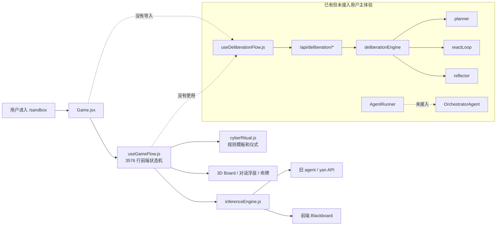
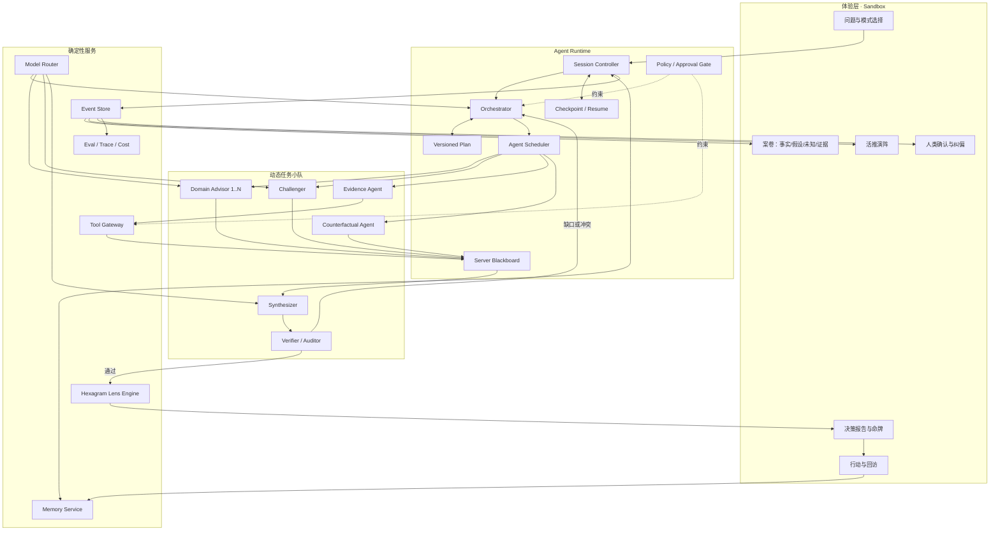

# 演策 Sandbox 生产级 Multi-Agent 系统设计与现状审计

> 日期：2026-08-07  
> 状态：待产品负责人审阅  
> 范围：整个 `/sandbox`，不是单独的智囊辩论模块  
> 目标：判断现有 Agent 是否生产可用，定义面向决策推演场景的能力边界、完整系统设计、动画协议、工程门槛、产品上限与止损条件

---

## 0. 执行结论

### 0.1 产品最高形态

演策不应继续定位成“更漂亮的算命网站”，也不应停留在“多个角色轮流调用 LLM”。合理的最高形态是：

> **一个以东方仪式为交互语言、以可验证 Multi-Agent 推演为内核、以长期结果反馈为壁垒的个人决策操作系统。**

用户带着一个真实纠结进入 Sandbox，系统围绕同一个持久任务完成：问题建模、信息补全、工具查证、动态组队、冲突推演、反事实审查、方案生成、人类确认、行动跟踪和结果复盘。卦象不是随机裁决器，而是受约束的认知扰动器；动画不是装饰，而是真实 Agent 事件的可视化。

### 0.2 当前是否生产级可用

**不是。当前前端能构建、旧流程能体验，但现有 Agent 系统不能被判定为生产级 Multi-Agent。**

主要原因不是“功能还少”，而是生产主链尚未成立：

1. 用户实际进入的 `/sandbox` 仍由 `Game.jsx → useGameFlow.js` 的前端大状态机驱动。
2. `useDeliberationFlow.js` 没有被任何页面导入，新的 Deliberation/ReAct 主链没有进入真实用户体验。
3. `AgentRunner`、`OrchestratorAgent` 有实现和局部测试，但没有进入生产调用图。
4. 新轨前端向 `/execute` 发送 `{ context }`，后端读取 `{ agentIds }`，契约不一致。
5. 新轨 Hook 期待 `blackboard/mentionQueue/convergence`，后端实际返回 `findings/oracle/dynamicChoices/masterSummary`，响应契约不一致。
6. `AgentRunner` 调用 `eventStore.append(...)`，但 `eventStore` 未导出 `append`，一旦真正接入会在运行时失败。
7. `AgentRunner` 的 correlationId 包含当前时间，所谓幂等缓存每次都会生成新键，正常情况下无法命中。
8. `AbortController` 只把 signal 传入 Context，但 Agent/LLM/工具并未统一消费；现有 Smoke Test 已证明 `BaseAgent` 超时契约失败。
9. `probeBackend()` 通过调用 `/api/deliberation/start` 探活，会创建真实的 `probe` 会话和数据垃圾。
10. Deliberation 会话接口大量使用 `optionalAuth`，允许请求体直接传 `userId`；SSE 端点没有会话所有权校验，并返回 `Access-Control-Allow-Origin: *`。
11. 工具注册表包含 mock 工具和静态过期数据，但 Agent 仍能把它们视为可用工具。
12. 只有 4 条 Smoke Test，没有端到端、契约、恢复、越权、降级标识和真实模型质量测试；其中 1 条当前失败。

因此，本项目目前适合继续作为体验原型和架构试验场，不适合声称“生产级 Agent 已完成”。

### 0.3 是否值得继续

值得继续，但前提是停止继续堆叠 Prompt、Agent 数量和仪式页面，先用一条真实、可测试、可恢复的 Agent 主链替换双轨和悬空架构。

推荐路径：

1. **近期：事件驱动的“活推演阵”**——把当前已写的后端能力收敛成唯一主链。
2. **中期：决策账本**——保存假设、证据、选择、反转条件和后续结果。
3. **长期：个人决策模型**——从真实结果中校准用户偏好和 Agent 表现。

如果无法获得真实结果回填、无法证明用户行动因此改善，产品上限会停在“高完成度的情绪型决策内容产品”，应及时收缩，而不是无限扩展 Agent 架构。

---

## 1. 设计原则

### 1.1 整个 Sandbox 才是 Agent

Agent 不是 `agent_debate` 阶段的几位智囊。对用户而言，整个 Sandbox 必须表现为一个连续、自主、可打断、可恢复的智能任务：

```text
输入问题
→ 建立案卷
→ 判断信息缺口
→ 追问或查证
→ 生成并更新计划
→ 组建任务小队
→ 进行推演
→ 审核与重规划
→ 卦象压力测试
→ 生成条件化方案
→ 用户选择与承诺
→ 行动跟踪
→ 结果复盘与校准
```

### 1.2 真 Agent 的判定不看文件名

项目里存在 `planner.js`、`reactLoop.js`、`reflector.js`、`Blackboard`，不等于用户已经获得 Agent 体验。真 Agent 必须在运行时满足：

- 目标明确；
- 计划可改变；
- 能根据观察选择下一行动；
- 可以自主选择工具和协作者；
- 关键判断可追溯；
- 失败不伪装成功；
- 用户能暂停、纠偏和恢复；
- 最终产物可以被后续结果验证。

### 1.3 不把所有模块都伪装成 Agent

生产级 Multi-Agent 不等于“什么都叫 Agent”。建议严格区分：

| 类型 | 是否是 Agent | 说明 |
|---|---:|---|
| Orchestrator | 是 | 根据目标和观察决定下一步 |
| Domain Advisor | 是 | 围绕明确任务独立分析，可使用被授权工具 |
| Challenger | 是 | 主动寻找反例、脆弱假设和失败条件 |
| Synthesizer | 是 | 从冲突与证据生成条件化方案 |
| Verifier/Auditor | 是 | 独立检查证据、覆盖度和一致性 |
| Memory Store | 否 | 确定性的数据服务，不需要人格化 |
| Tool Gateway | 否 | 权限、超时、审计和结果标准化服务 |
| Policy Engine | 否 | 确定性安全规则与人工审批门禁 |
| Animation Engine | 否 | 消费事件，不参与业务判断 |

这样既能真正实践 Multi-Agent，又避免“用 LLM 取代普通函数”的过度设计。

### 1.4 人类拥有最终决定权

低风险的读取、分析和模拟可自主执行；以下动作必须由用户明确确认：

- 采用哪个行动方案；
- 保存或删除长期记忆；
- 对外分享包含个人信息的命牌；
- 创建通知、发送消息、提交表单或任何外部写操作；
- 医疗、法律、金融等高风险场景中的实际行动。

---

## 2. 当前系统事实图

### 2.1 当前用户真实主链与悬空新链



### 2.2 当前旧轨具备的真实价值

旧轨并非毫无价值，已经积累了可复用能力：

- 完整可体验的仪式和页面状态；
- 智囊角色池、选择和展示；
- 前端 Blackboard、mention、轮次与收敛检测；
- 工具调用的 UI 状态；
- 本地降级与防白屏经验；
- 命牌、收藏、记忆和回访雏形；
- 大量关于按钮遮挡、阶段自动跳转和 SSE 污染的工程经验。

这些能力应被迁移到新的 Session/Event 架构，而不是整体推倒重来。

### 2.3 当前新轨具备的真实价值

新轨也不是纯文档或空壳：

- Deliberation Session 与状态持久化；
- Planner、Autonomy Gate、Tool Probe；
- ReAct 的 Think→Act→Observe 循环；
- Advisor 并行调用；
- Reflector 覆盖检查、冲突检查和有限重规划；
- Event Store、Event Bus、SSE；
- 记忆召回、总结、画像提取；
- Eval Pipeline 雏形；
- Pause/Resume 和快照雏形。

但这些模块仍是“可研究的架构原型”，没有经过生产主链、契约和安全验证。

---

## 3. 生产就绪度审计

评分含义：0=不存在，1=概念或占位，2=局部可运行，3=开发环境可验证，4=小流量生产可用，5=成熟生产能力。

| 能力域 | 当前评分 | 当前事实 | 到生产级还缺什么 |
|---|---:|---|---|
| 用户主流程 | 2 | 旧轨可体验，新轨未接入 | 唯一主链、版本迁移、完整恢复 |
| 任务规划 | 2 | Planner/ReAct 存在 | 契约统一、计划版本、真实重规划测试 |
| Agent 独立性 | 1.5 | 多 persona 发言和局部任务 | Agent Contract、独立上下文、权限与完成条件 |
| Agent 协作 | 2 | 前端 Blackboard/mention | 服务端权威黑板、因果引用、并发冲突控制 |
| 工具系统 | 2 | 部分真实查询和本地计算 | 去 mock、来源验证、缓存、授权、注入防护 |
| 记忆 | 2 | 本地与服务端均有雏形 | 用户确认、纠错、删除、租户隔离、质量评估 |
| 事件与恢复 | 2 | Event Store/SSE/Pause 有实现 | API 修复、事件版本、幂等、断线重放一致性 |
| 人类审批 | 1 | 流程按钮较多 | 明确 Policy Gate、审批事件、外部写操作隔离 |
| 降级透明度 | 2 | 有大量 fallback | 统一来源标签，禁止 mock 冒充真实成功 |
| 安全与租户隔离 | 1 | `optionalAuth` 和客户端 userId | 正式身份、会话 owner、SSE 鉴权、限额、审计 |
| 可观测性 | 1.5 | 日志、事件和 Eval 雏形 | Trace、成本、质量、版本、告警和回放工具 |
| 测试 | 1 | 4 条 Smoke，当前 1 条失败 | 契约/E2E/恢复/安全/真实模型回归测试 |
| 动画语义 | 1.5 | 仪式效果丰富 | 统一事件驱动、可跳过、失败态、可访问性 |
| 结果闭环 | 1.5 | 回访与记忆雏形 | 真实结果结构、校准指标、用户修正与长期实验 |

### 3.1 当前阻断生产的 P0 问题

#### P0-1：新旧双轨没有形成可切换的同一产品

- `Game.jsx` 只使用 `useGameFlow`。
- `useDeliberationFlow` 只有定义，无调用方。
- `featureFlags.js` 的注释、常量和 getter 行为互相矛盾，且实际入口未消费。

结论：不能声称“新轨默认开启”，因为它根本没有成为页面主链。

#### P0-2：前后端 execute 契约不一致

前端发送：

```json
{
  "context": {
    "context": "用户问题",
    "round": 1
  }
}
```

后端读取：

```json
{
  "agentIds": []
}
```

Hook 期待的响应字段与 Engine 实际响应字段也不同。即使把 Hook 直接接进页面，流程也不能可靠工作。

#### P0-3：AgentRunner 当前不可直接进入生产

- 调用了不存在的 `eventStore.append`；
- correlationId 含时间戳，幂等缓存无法正常复用；
- AbortSignal 没有贯穿 LLM 和工具；
- Smoke Test 已出现 5 秒后未按 40ms 超时拒绝的问题；
- Runner 的熔断、事件和重试未经过集成测试。

#### P0-4：身份和会话所有权不足

- Deliberation 多数接口使用 `optionalAuth`；
- 请求体可直接提供 `userId`；
- 根据 sessionId 读取、执行、暂停、提交时未统一验证 owner；
- SSE 无身份校验且允许任意来源。

这意味着知道 sessionId 的调用方可能读取或操作别人的推演。

#### P0-5：工具结果不能全部视为可靠证据

- `note_create`、`translate_text` 明确为 mock；
- 黄历和宏观数据包含固定快照；
- 搜索依赖 HTML/建议接口，缺少来源可信度与正文验证；
- `company_info` 只是普通搜索包装；
- 高风险场景的工具授权规则没有成为统一执行门禁。

#### P0-6：探活具有写副作用

`probeBackend()` 调用 `/start` 并创建真实 Session。生产探活必须是只读、幂等、无业务数据写入的 `/health`。

### 3.2 已验证结果

- `npm run build`：通过。
- `node --test tests/smoke.test.js`：4 条中 3 条通过，1 条失败。
- 失败项：`BaseAgent.run` 未满足超时拒绝契约。
- 未验证：真实 LLM 端到端推演、工具网络稳定性、断线恢复一致性、跨用户授权、生产部署上的 SSE 行为。

---

## 4. 目标产品架构

### 4.1 逻辑分层



### 4.2 单一事实来源

生产系统必须明确：

- 后端 Session + Event Store 是状态事实来源；
- 前端只维护展示状态和临时输入；
- Blackboard 存在于服务端，不以 React Ref 为权威；
- 所有 Agent 动作先产生领域事件，再由 UI 播放；
- 恢复时由 Snapshot + Event Replay 还原；
- 本地降级创建明确的 `LOCAL_DEGRADED` 会话，不冒充远端 Agent 会话。

---

## 5. 完整 Sandbox 状态机

```mermaid
stateDiagram-v2
    [*] --> Intake

    state Intake {
        [*] --> CaptureQuestion
        CaptureQuestion --> SelectMode
        SelectMode --> CreateSession
    }

    CreateSession --> RitualSeed
    RitualSeed --> BuildCaseModel

    state InformationAcquisition {
        state "信息价值排序" as IA_Score
        state "追问用户" as IA_Ask
        state "召回记忆" as IA_Memory
        state "确认旧记忆" as IA_ConfirmMemory
        state "查询外部工具" as IA_Tool
        state "验证工具证据" as IA_Validate
        state "接受显式假设" as IA_Assumption
        state "更新案卷" as IA_Update
        [*] --> IA_Score
        IA_Score --> IA_Ask: 高信息价值且只能问用户
        IA_Score --> IA_Memory: 历史中可能已有
        IA_Score --> IA_Tool: 可由外部证据获得
        IA_Score --> IA_Assumption: 用户允许带假设继续
        IA_Ask --> IA_Update
        IA_Memory --> IA_ConfirmMemory
        IA_ConfirmMemory --> IA_Update
        IA_Tool --> IA_Validate
        IA_Validate --> IA_Update
        IA_Assumption --> IA_Update
        IA_Update --> IA_Score
        IA_Score --> [*]: 信息充分或用户要求先推演
    }

    BuildCaseModel --> InformationAcquisition
    InformationAcquisition --> CreatePlan
    CreatePlan --> HumanPlanView
    HumanPlanView --> AssembleTeam

    state Deliberation {
        state "调度任务" as D_Schedule
        state "Agent 独立思考" as D_Think
        state "调用工具" as D_Tool
        state "验证证据" as D_Validate
        state "发布结构化观点" as D_Publish
        state "观察服务端黑板" as D_Observe
        state "挑战观点" as D_Challenge
        state "支持观点" as D_Support
        state "请求更多信息" as D_Ask
        state "用户补充或纠偏" as D_User
        state "更新推演案卷" as D_UpdateCase
        state "覆盖度审计" as D_Coverage
        state "重规划" as D_Replan
        state "合成条件化方案" as D_Synthesize
        state "独立验证" as D_Verify
        [*] --> D_Schedule
        D_Schedule --> D_Think
        D_Think --> D_Tool
        D_Think --> D_Publish
        D_Tool --> D_Validate
        D_Validate --> D_Publish
        D_Publish --> D_Observe
        D_Observe --> D_Challenge
        D_Observe --> D_Support
        D_Observe --> D_Ask
        D_Challenge --> D_Coverage
        D_Support --> D_Coverage
        D_Ask --> D_User
        D_User --> D_UpdateCase
        D_UpdateCase --> D_Replan
        D_Coverage --> D_Replan: 有关键缺口或冲突
        D_Coverage --> D_Synthesize: 覆盖充分
        D_Replan --> D_Schedule
        D_Synthesize --> D_Verify
        D_Verify --> D_Replan: 不通过且预算允许
        D_Verify --> [*]: 通过或达到停止条件
    }

    AssembleTeam --> Deliberation
    Deliberation --> HexagramLens

    state HexagramLens {
        [*] --> MapFactsToLines
        MapFactsToLines --> SelectCognitiveLens
        SelectCognitiveLens --> CounterfactualStressTest
        CounterfactualStressTest --> DetectReversalConditions
        DetectReversalConditions --> [*]
    }

    HexagramLens --> GenerateOptions
    GenerateOptions --> ApprovalRequired
    ApprovalRequired --> UserCorrects: 修改事实/权重/约束
    UserCorrects --> CreatePlan
    ApprovalRequired --> UserChooses
    UserChooses --> Commitment
    Commitment --> DecisionArtifact
    DecisionArtifact --> FollowUpSchedule
    FollowUpSchedule --> Paused
    Paused --> OutcomeReview: 3/7/30/90天
    OutcomeReview --> CalibrateMemory
    CalibrateMemory --> [*]

    CreatePlan --> Paused: 用户暂停
    Deliberation --> Paused: 断线或用户暂停
    Paused --> CreatePlan: 恢复到规划阶段
    Paused --> Deliberation: 恢复到推演阶段
```



### 5.1 为什么不能继续由 `phase` 控制一切

现有 `useGameFlow.js` 将业务状态、动画状态、网络状态、对话状态和仪式状态耦合在同一 Hook。目标架构应拆为：

```text
Business State：Session/Plan/Task/Claim/Evidence/Decision
Interaction State：当前输入、展开项、选择项
Animation State：根据事件短暂播放，不改变业务真相
Transport State：SSE 连接、重连、游标、离线
```

动画完成不能触发业务推进；业务事件也不能因为动画失败而丢失。

---

## 6. Agent Contract

### 6.1 每个 Agent 必须有明确合同

```ts
type AgentContract = {
  id: string;
  version: string;
  role: 'orchestrator' | 'domain' | 'challenger' | 'evidence' | 'future' | 'synthesizer' | 'auditor';
  objective: string;
  inputSchema: JsonSchema;
  outputSchema: JsonSchema;
  allowedTools: string[];
  memoryScope: 'none' | 'session' | 'approved_long_term';
  maxSteps: number;
  maxModelCalls: number;
  deadlineMs: number;
  completionCriteria: string[];
  stopConditions: string[];
  escalationPolicy: string;
  safetyPolicyVersion: string;
};
```

Persona 只决定表达风格，不能替代 objective、schema、权限和完成条件。

### 6.2 Agent 输出必须结构化

```ts
type Finding = {
  id: string;
  taskId: string;
  agentId: string;
  claim: string;
  stance: 'support' | 'oppose' | 'neutral';
  confidence: number;
  evidenceRefs: string[];
  assumptionRefs: string[];
  unknownRefs: string[];
  affectsOptions: string[];
  createdAt: string;
};
```

只有文字发言不能支撑生产级协作。每个观点必须可以进入覆盖检查、冲突检测和结果追溯。

### 6.3 Orchestrator 的能力边界

Orchestrator 可以：

- 创建和修改计划；
- 决定需要哪类 Agent；
- 在预算内安排任务；
- 请求工具读取；
- 请求用户补充信息；
- 因证据或审计失败而重规划；
- 提前停止低价值步骤。

Orchestrator 不可以：

- 绕过 Policy Gate；
- 把推断写成事实；
- 直接修改用户长期记忆；
- 代表用户执行外部写操作；
- 隐藏失败或伪造工具结果；
- 在高风险领域给出确定性诊断或收益承诺。

### 6.4 动态小队的默认规模

- 快速起卦：1 个 Domain + 1 个 Challenger + 1 个 Synthesizer/Auditor；
- 标准推演：2 个 Domain + 1 个 Challenger + 1 个 Evidence + 1 个 Auditor；
- 深度推演：最多 6 个活跃 Agent，按任务分批运行；
- 不以更多 Agent 作为高级能力卖点；
- Agent 没有独立任务或新证据时，不应被召唤。

---

## 7. 信息收集与案卷模型

### 7.1 案卷不是聊天摘要

```ts
type DecisionCase = {
  objective: string;
  successCriteria: Criterion[];
  facts: Fact[];
  constraints: Constraint[];
  preferences: Preference[];
  assumptions: Assumption[];
  unknowns: Unknown[];
  options: Option[];
  evidence: Evidence[];
  risks: Risk[];
  reversalConditions: ReversalCondition[];
};
```

必须明确区分：

- 用户亲口确认；
- 历史记忆召回且本次确认；
- 工具验证；
- Agent 推断；
- 暂时未知。

### 7.2 问题选择策略

默认追问 2～4 个高价值问题，允许“快速起卦”和“深度推演”。问题优先级：

```text
QuestionPriority =
  结论反转概率
  × 当前不确定度
  × 可回答程度
  × 安全重要性
  ÷ 用户回答成本
```

每一问都展示一句原因。用户可回答“不知道”“不愿回答”“按假设继续”。

### 7.3 记忆必须可见、可纠正

当系统引用历史记忆时显示：

> “上次推演中你提到更看重稳定性，本次继续采用吗？”

不得静默把旧偏好当作永久事实。用户必须能够查看、纠正、删除和禁止本局使用长期记忆。

---

## 8. 卦象的能力边界

### 8.1 定位

卦象是受约束的认知扰动器，不是事实来源或最终裁判。

- 事实由用户陈述、工具和可信数据决定；
- Agent 负责分析；
- 卦象负责迫使系统从非惯常角度审查；
- 用户负责最终选择。

### 8.2 数据到卦象的映射

推荐映射：

| 推演数据 | 爻象表达 |
|---|---|
| 已确认且稳定的事实 | 阳爻 |
| 未知或两可的信息 | 阴爻 |
| 最可能反转结论的变量 | 动爻 |
| 观点间主要冲突 | 上下卦张力 |
| 条件变化后的新方案 | 变卦 |

用户投币与心念数字只提供可复现的 Session Seed，用于在多个同等合理的审查视角中选择，不允许覆盖安全规则和已验证事实。

### 8.3 64 卦策略库

每卦需要对应结构化审查策略，而不是只有卦辞：

```ts
type HexagramLens = {
  hexagramId: number;
  themes: string[];
  questions: string[];
  failureModes: string[];
  counterfactualPrompts: string[];
  forbiddenUses: string[];
};
```

例如“坎”审查连续风险和退出路径，“艮”审查暂停与成熟条件，“革”审查旧结构是否失效，“未济”审查缺失的前置条件。

---

## 9. Agent 事件与动画协议

### 9.1 核心原则

> 没有真实领域事件，就不能播放对应动画。

事件至少包含：

```ts
type AgentEvent = {
  eventId: string;
  sessionId: string;
  sequence: number;
  type: string;
  actorId: string;
  taskId?: string;
  causationId?: string;
  correlationId: string;
  payload: Record<string, unknown>;
  visibility: 'public' | 'summary' | 'internal';
  createdAt: string;
  schemaVersion: number;
};
```

`sequence` 用于断线重放，`causationId` 用于解释“为什么发生”，`visibility` 防止把系统 Prompt、隐私或内部推理直接暴露给前端。

### 9.2 事件到动画的语义映射

| 事件 | 动画 | 用户获得的信息 |
|---|---|---|
| `PLAN_CREATED` | 阵心生成任务轨道 | 系统开始规划 |
| `PLAN_REVISED` | 外环逆转，旧轨重组 | 系统改变了原计划 |
| `UNKNOWN_IDENTIFIED` | 爻位断开、雾化 | 这里仍不确定 |
| `MEMORY_RECALLED` | 旧签残影进入案卷 | 使用了历史信息 |
| `AGENT_ASSIGNED` | 智囊席位点亮 | 专家因明确任务加入 |
| `TOOL_STARTED` | 光束离阵 | 正在外部查证 |
| `EVIDENCE_ACCEPTED` | 证据符落入议题 | 获得已验证依据 |
| `CLAIM_CHALLENGED` | 两席间短促红线 | 出现真实冲突 |
| `CONSENSUS_FORMED` | 多条轨迹合流 | 形成有限共识 |
| `AUDIT_FAILED` | 阵心失衡并出现缺口 | 当前结论不合格 |
| `APPROVAL_REQUIRED` | 全场暂停并出现人印 | 轮到用户决定 |
| `ACTION_FAILED` | 对应符号破损并显示原因 | 系统没有假装成功 |
| `SESSION_COMPLETED` | 事实和冲突收束成卦 | 卦象是推演结晶 |

### 9.3 动画强度

- 持续状态动画：低频呼吸、微弱能量流；
- 行为动画：0.4～1.2 秒；
- 结构变化：1.5～2.5 秒；
- 最终落印：整局唯一的高强度动画；
- 所有动画可跳过，支持 `prefers-reduced-motion`；
- 动画不得持有业务锁，不得遮挡审批按钮；
- 断线恢复只重放必要事件，不把整局动画重新播一遍。

### 9.4 页面信息布局

- 中央：2.5D/3D 活推演阵，只展示结构与关系；
- 左侧：案卷，展示事实、假设、未知和证据；
- 右侧：任务小队，展示每位 Agent 的当前任务、进度和贡献；
- 底部：当前行动、用户输入、暂停、纠偏和审批；
- 详情：DOM 面板，不在 Three.js 中承载长文本和关键按钮。

Three.js 应从“页面主体”退回为“中央语义可视化引擎”。

---

## 10. 工具、权限与证据

### 10.1 Tool Gateway

所有工具必须经过统一网关：

```text
Agent Request
→ 参数 Schema 校验
→ 权限检查
→ 风险分类
→ 是否需要用户批准
→ 超时/取消
→ 执行
→ 来源与时间戳标准化
→ 内容安全和 Prompt Injection 清理
→ Evidence 入库
→ 审计事件
```

### 10.2 工具分级

| 级别 | 示例 | 策略 |
|---|---|---|
| R0 纯计算 | 薪资估算、日期计算 | 可自动执行，标明公式版本 |
| R1 公共读取 | 天气、汇率、公开搜索 | 可自动执行，保留来源和时间 |
| R2 敏感读取 | 用户邮箱、日历、私人文档 | 首次授权，最小范围 |
| R3 外部写入 | 建提醒、发消息、提交表单 | 每次明确审批 |
| R4 高风险行动 | 交易、医疗处置、法律提交 | 默认禁止，仅提供分析和人工交接 |

### 10.3 证据等级

- E0：Agent 推断；
- E1：用户陈述；
- E2：普通网络来源；
- E3：权威或一手来源；
- E4：用户确认的正式材料。

结论必须能说明用了哪些证据等级。高风险结论不得只依赖 E0/E2。

---

## 11. AI 场景能力边界

### 11.1 适合 Agent 的场景

| 场景 | Agent 价值 | 可实现性 |
|---|---|---:|
| 职业选择、Offer、转行 | 多约束比较、公开信息查证、反事实推演 | 高 |
| 城市迁移、租房、旅行规划 | 天气、成本、通勤、政策与偏好组合 | 高 |
| 学习与项目选择 | 目标拆解、时间计划、机会成本 | 高 |
| 一般关系沟通 | 立场模拟、沟通脚本、边界梳理 | 中高 |
| 创业与产品决策 | 市场假设、Pre-mortem、实验设计 | 中高 |
| 个人消费决策 | 需求澄清、预算、替代方案 | 高 |

### 11.2 有条件适用的场景

| 场景 | 允许做什么 | 不允许做什么 |
|---|---|---|
| 健康 | 整理症状、提示就医、准备问诊问题 | 诊断、处方、延误急救 |
| 心理 | 情绪梳理、资源指引、风险提示 | 替代治疗、操纵依赖、危机误判 |
| 法律 | 整理事实、列问题、查公开法规 | 给确定法律结论、代替律师提交 |
| 金融 | 风险教育、情景分析、预算 | 收益保证、自动交易、神谕荐股 |
| 婚育家庭 | 价值与边界梳理 | 替用户作不可逆决定 |

### 11.3 不应进入的场景

- 紧急医疗或自伤他伤危机；
- 通过“命运已定”制造恐惧和依赖；
- 基于敏感属性进行歧视性判断；
- 未经同意分析第三方隐私；
- 让卦象覆盖证据和安全规则；
- 对用户进行隐藏的说服或商业操纵。

---

## 12. 需求之外值得加入的 AI 场景

### 12.1 决策 Pre-mortem

用户选择方案后，Challenger 假设“六个月后失败了”，倒推最可能的三个原因，并转化为提前预防动作。

### 12.2 结论反转监测

每个结论保存反转条件：

> “如果获得税后收入不低于当前 80% 的 Offer，建议从暂缓转为行动。”

未来变量改变时，系统不是重新算命，而是提醒“原结论的条件已经改变”。

### 12.3 沟通与谈判演练

根据推演结果，让 Agent 分别扮演老板、伴侣、家人或合作方，帮助用户练习表达和应对异议。该模块的任务是训练，不是替用户发送消息。

### 12.4 多方共同决策

家庭、伴侣或团队成员分别提交自己的目标与红线，系统展示共识、冲突和不可交换条件。必须获得各方同意，不能让一方偷偷分析另一方。

### 12.5 决策复盘教练

结果不理想时，区分：

- 决策过程错误；
- 信息不足；
- 执行失败；
- 外部随机事件；
- 结果差但当时决策仍合理。

这比宣传“卦准不准”更有长期价值。

### 12.6 Agent Studio

为用户和开发者提供受控的 Agent 设计入口：

- 定义角色目标，不只写 Persona；
- 选择工具权限；
- 定义输入/输出 Schema；
- 设置完成条件和预算；
- 用历史案例回放测试；
- 查看与基线 Agent 的质量差异；
- 通过评估后才能进入真实推演。

这是用户真正参与 Multi-Agent 设计、获得生产级经验的入口。

---

## 13. 用户如何参与并获得生产级 Multi-Agent 经验

### 13.1 推演中的参与

用户可以：

- 修改目标与成功标准；
- 调整某个约束的权重；
- 确认或否定系统假设；
- 禁用某段长期记忆；
- 增加、替换或移除一个 Agent；
- 要求某 Agent 解释证据；
- 让 Challenger 专门攻击某条方案；
- 暂停、重规划或提前收敛；
- 决定是否执行外部写操作。

### 13.2 Agent Studio 的工程视图

高级模式展示真正有教育价值的内容：

```text
Session
Plan Version
Task Graph
Agent Contract
Tool Permission
Event Timeline
Evidence Graph
Cost/Latency
Eval Result
Replay Diff
```

用户学到的不是“写一个很长的系统 Prompt”，而是：

- 如何切分 Agent 和普通服务；
- 如何定义输入输出合同；
- 如何设计工具权限；
- 如何建立事件和状态；
- 如何做失败恢复和幂等；
- 如何评估 Agent 是否真的更好；
- 如何设置人工审批门禁。

### 13.3 发布流程

用户自定义 Agent 应经过：

```text
草稿
→ Schema 校验
→ 静态安全检查
→ 标准场景评估
→ 与基线对比
→ 私人试用
→ 小流量发布
→ 质量监控
→ 回滚或升级
```

这会把“智囊市集”从角色卡片商店升级成真正的 Agent 生态。

---

## 14. 输出物与留存闭环

### 14.1 一次推演的六个正式产物

1. 条件化判断；
2. 关键依据与来源；
3. 最大分歧；
4. 结论反转条件；
5. 低成本下一步实验；
6. 情绪化压缩后的命牌。

命牌是传播载体，不能替代正式决策报告。

### 14.2 决策账本

每次记录：

```text
当时的问题
已知事实与未知变量
采用的假设
使用过的工具和证据
Agent 的主要分歧
用户最终选择
反转条件
计划行动
3/7/30/90 天结果
复盘结论
```

### 14.3 留存节奏

- 当天：第一个行动实验；
- 3 天：是否执行；
- 7 天：关键变量是否变化；
- 30 天：结果复盘；
- 90 天：长期结果与决策模式更新。

留存来自“决定仍在发展”，而不是无意义签到。

### 14.4 数据壁垒

真正有价值的数据不是原始聊天，而是结构化的：

```text
决策类型
事实与约束
用户价值权重
当时方案
Agent 分歧
反转条件
用户选择
真实结果
复盘归因
```

只有获得真实结果，系统才能校准 Agent；否则“越来越懂你”只是营销语言。

---

## 15. 可靠性、安全和可观测性

### 15.1 必须统一的运行保证

- 稳定的 idempotency key 由客户端动作 ID 或任务 ID 产生，不含当前时间；
- 所有 LLM 和工具支持 AbortSignal；
- Retry 只用于幂等读取；
- 外部写操作不得自动重试；
- Event append 与状态变更具有一致性边界；
- 每个 Agent Run 记录版本、输入摘要、工具、成本、延迟和结果状态；
- 断线恢复从最后 sequence 继续；
- 同一 Session 同一任务避免重复执行；
- 所有 fallback 必须在事件和 UI 中标记来源。

### 15.2 隐私与身份

- 不再信任客户端 `userId`；
- Session、Memory、Advisor、Event 均验证 owner；
- SSE 使用短期会话令牌或同源认证；
- 敏感数据支持删除和导出；
- 长期记忆写入需要可见提示；
- 多方决策必须有每位参与者的明确同意；
- 日志不得记录完整隐私文本和密钥。

### 15.3 评估体系

离线评估：

- 计划与问题匹配度；
- 高价值问题比例；
- 重复追问率；
- Agent 观点独立性；
- 证据引用正确率；
- 未支持断言率；
- 反转条件质量；
- 高风险边界遵守率；
- 降级标识完整率。

在线指标：

- 首次有效洞察时间；
- 推演完成率；
- 用户纠偏率；
- 计划真实变化率；
- Agent 有效冲突率；
- 工具成功率和证据覆盖率；
- 行动实验采纳率；
- 3/7/30/90 天回填率；
- 复盘后用户认为“当时过程合理”的比例。

---

## 16. M3 验收定义

这里的 M3 是本项目内部定义的“可自主执行、可观察、可纠偏、可恢复的多 Agent 推演系统”，不是引用某个统一行业标准。对外宣传前应说明采用的分级来源或直接展示以下可验证能力，避免只用等级名称制造误解。

一次推演同时满足以下条件，才能称为 M3：

1. 根据用户目标动态生成计划；
2. 计划具有版本，且能因新信息真实变化；
3. Orchestrator 可以自主选择工具和 Agent；
4. Agent 有独立任务合同、权限和停止条件；
5. Agent 观点包含证据、假设和未知引用；
6. 协作关系可以追溯因果，而非仅拼接前文；
7. 存在独立审核和至少一次可触发的重规划路径；
8. 信息不足时提出有理由的问题；
9. 用户拒答时可以带显式假设继续；
10. 支持暂停、恢复、打断和纠偏；
11. 失败、mock、降级不会冒充成功；
12. 关键选择必须由人类确认；
13. 输出包含反转条件和可执行实验；
14. 后续真实结果能够回写并参与校准；
15. 通过契约、E2E、恢复、安全和真实模型评估。

### 16.1 技术发布门槛

建议在进入小流量生产前至少达到：

- 50 个标准场景端到端完成率 ≥ 95%；
- 越权读取/操作测试 0 通过；
- 未标记 mock/fallback 0 次；
- 断线恢复后任务重复执行率 0；
- 高风险边界测试通过率 100%；
- Agent 关键断言证据或假设标记覆盖率 ≥ 95%；
- 前端业务状态与后端 Session 最终一致率 100%。

这些是发布门槛，不是当前已达到的结果。

---

## 17. 分阶段改造边界

### 阶段 0：建立可信基线

目标：不增加新玩法，先证明现状。

- 固定前后端契约；
- 修复 AgentRunner 事件、超时、幂等；
- 改为只读健康检查；
- 增加会话 owner 校验；
- 删除或禁用 mock 工具；
- 建立 20～50 个标准场景和 E2E 骨架；
- 为旧轨和新轨建立相同的结果对比。

退出条件：新轨可以在开发环境完整跑通且所有降级可见。

### 阶段 1：唯一 Agent 主链

- `/sandbox` 接入后端 Deliberation Session；
- 后端成为业务状态权威；
- 旧 `useGameFlow` 保留为 feature flag 下的可回滚版本；
- Planner、Scheduler、Blackboard、Verifier 串通；
- 支持暂停、恢复、重规划和审批。

退出条件：标准推演不再由前端 phase 硬编码业务推进。

### 阶段 2：事件驱动的活推演阵

- 建立版本化 Agent Event Schema；
- 动画仅消费事件；
- 案卷、Agent 任务、证据和冲突可见；
- 完成计划、查证、冲突、重规划、审批、结晶六类动画；
- 支持减少动画和快速恢复。

退出条件：用户能够仅通过 UI 说清 Agent 为什么采取下一步。

### 阶段 3：卦象认知扰动器

- 64 卦结构化 Lens；
- 事实/未知/冲突到爻的映射；
- 变卦生成反事实和反转条件；
- 建立高风险禁用规则。

退出条件：卦象能改变审查问题，但不能改变事实。

### 阶段 4：决策账本和校准

- 保存结构化决策产物；
- 行动实验与 3/7/30/90 天回访；
- 用户可纠正记忆；
- Agent 表现与真实结果对照；
- 建立长期产品指标。

退出条件：能够证明至少一类用户会因为持续复盘而回来。

### 阶段 5：Agent Studio

- Agent Contract 编辑；
- 工具权限；
- 场景回放；
- 基线对比；
- 分阶段发布与回滚；
- 智囊市集升级为经过评估的 Agent 生态。

退出条件：用户创建的 Agent 在标准评估上可测、可审计、可回滚。

---

## 18. 产品上限与止损条件

### 18.1 可能的产品上限

#### 上限 A：仪式型内容产品

如果用户主要为了命牌、分享和情绪安慰，产品可以成为高完成度赛博算命内容产品，但 Agent 架构投入不会形成相应回报。

#### 上限 B：决策辅助工具

如果用户认可案卷、证据、反转条件和行动实验，但回访弱，产品适合成为按次付费或订阅的深度决策工具。

#### 上限 C：个人决策操作系统

只有当用户愿意持续回填结果、允许系统使用历史决策，并且后续建议因此变得更有效，才可能达到最高形态。

### 18.2 必须验证的产品假设

1. 用户是否愿意为一个真实问题投入 5～12 分钟？
2. 用户是否认为 Agent 的冲突和查证比单模型回答更有价值？
3. 用户是否会执行至少一个低成本行动实验？
4. 用户是否愿意在 7～30 天后回来报告结果？
5. 长期记忆是否真的改善后续推演，而不是制造偏见？
6. 赛博算命是否增强信任和记忆点，而不是削弱严肃性？
7. 用户是否理解卦象是认知镜头而非命运裁决？

### 18.3 建议的止损门槛

以下门槛应通过真实用户实验确定，首轮可采用这些假设值：

- 标准推演完成率长期低于 40%；
- 少于 25% 的完成用户认为系统发现了自己未想到的关键变量；
- 少于 15% 的完成用户采纳一个行动实验；
- 30 天回访触达后回填率低于 10%；
- Multi-Agent 版本相较单 Agent 基线没有显著质量提升，却增加两倍以上成本或延迟；
- 用户主要只分享命牌，几乎不查看案卷、证据和反转条件；
- 高风险误导无法控制到可接受范围。

若连续两个迭代周期仍未改善，应停止扩大 Multi-Agent 复杂度，并选择：

- 收缩为轻量赛博算命内容产品；或
- 去掉重仪式，转为垂直决策工具；或
- 聚焦表现最好的单一场景，例如职业选择或城市迁移。

### 18.4 不应沉没成本驱动

已有 Three.js、64 卦、Agent Pool 和大量流程代码不是继续投入的理由。继续与否只看：

- 用户是否获得单模型无法提供的价值；
- 是否产生可验证的行动改善；
- 是否形成真实结果数据；
- 系统复杂度是否可运营和可维护。

---

## 19. 推荐决策

### 19.1 现在该做什么

批准“阶段 0：可信基线”和“阶段 1：唯一 Agent 主链”的实施规划，暂缓继续增加视觉特效、智囊数量和外围页面。

### 19.2 现在不该做什么

- 不继续在 `useGameFlow.js` 上叠加新的业务阶段；
- 不直接把未验证的 `useDeliberationFlow` 接入生产；
- 不把所有服务都改名成 Agent；
- 不用更多 Prompt 模拟自主性；
- 不允许 mock 工具进入证据链；
- 不先建设大规模 Agent 市集；
- 不宣称已经达到生产级或 M3。

### 19.3 最终产品公式

```text
真实 Agent Runtime
× 可验证的决策证据结构
× 东方仪式化可视语言
× 长期结果反馈数据
= 个人决策操作系统
```

只有动画，是算命玩具；只有 Agent，是普通决策助手；只有记忆，是聊天记录；只有卦象，是随机叙事。四者形成闭环，才构成演策真正的产品与工程壁垒。

---

## 20. 规格确认后的下一步

用户确认本规格后，再单独编写实施计划。实施计划必须：

1. 先修 P0 契约、安全和 Runtime，不改视觉；
2. 为每一步提供失败测试和验收测试；
3. 明确旧轨到新轨的 feature flag、回滚和数据迁移；
4. 不覆盖当前工作区中已有的用户修改；
5. 每阶段都能独立演示和停止，而不是一次性大重构。

---

## 21. 当前审计证据索引

| 结论 | 代码证据 |
|---|---|
| `/sandbox` 使用旧轨 | `src/pages/Game.jsx` 调用 `useGameFlow({ DEFAULT_CHOICES })` |
| 新轨 Hook 未接入 | `src/game/useDeliberationFlow.js` 只有导出；全项目没有调用方 |
| execute 请求契约不一致 | `src/services/deliberationClient.js:executeDeliberation` 发送 `{ context }`；`server/src/routes/deliberation.js` 读取 `{ agentIds }` |
| 新轨响应消费不一致 | `useDeliberationFlow` 读取 `blackboard/mentionQueue/convergence`；`deliberationEngine.buildExecuteResponse` 返回 `findings/oracle/conflicts/gaps/dynamicChoices/masterSummary` |
| AgentRunner 事件接口错误 | `server/src/agents/AgentRunner.js` 调用 `eventStore.append`；`server/src/services/eventStore.js` 默认导出中无 `append` |
| 幂等键无法稳定复用 | `AgentRunner` 使用 `[sessionId, agent.id, round, now]` 生成 correlationId |
| 超时契约失败 | `server/tests/smoke.test.js` 的 AgentRunner/BaseAgent 超时测试；当前执行结果为 4 条中 1 条失败 |
| 探活有写副作用 | `src/services/deliberationClient.js:probeBackend` POST `/api/deliberation/start` |
| 会话所有权不足 | `server/src/routes/deliberation.js` 多数路由使用 `optionalAuth`，并接受 body/query 中的 `userId` |
| SSE 缺少会话鉴权 | `GET /api/deliberation/:sessionId/events` 未验证 owner，并设置 `Access-Control-Allow-Origin: *` |
| 工具并非全真实 | `server/src/services/mcpService.js` 明确标记 `note_create`、`translate_text` 为 mock，宏观与黄历为静态数据 |
| 当前前端可构建 | 2026-08-07 执行 `npm run build` 成功，1061 个模块完成转换 |

审计只基于本地代码和本轮执行结果。真实模型质量、生产网络工具、部署端 SSE、跨设备恢复和线上安全状态尚未得到验证。
