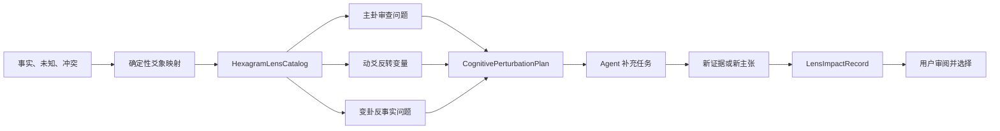

# 06 · 卦象认知扰动器设计

## 1. 阶段目标

把现有“观点强弱 → 吉凶 → 可进或宜止”的卦象链路，改造成可复现、可解释、可关闭的认知扰动器。

卦象不替用户决策，也不提供事实。它只负责让 Multi-Agent 系统从一个非惯常但结构化的角度继续追问：还有什么假设没有验证、什么变量会反转结论、什么退出条件尚未准备。

本阶段完成后，用户应能回答：

1. 这一卦由哪些已知、未知与冲突形成；
2. 它给 Agent 增加了哪些审查任务；
3. 新任务带来了什么证据或反事实；
4. 哪些结论完全不受卦象影响；
5. 关闭卦象层后，事实、安全和审批为什么保持不变。

## 2. 当前问题

当前 `server/src/services/reflector.js` 已有确定性的六爻映射，但仍存在三类越界：

- 用 Agent 的正负倾向统计“吉/凶”；
- 根据正负数量输出“可进”“宜止”；
- 先形成结论，再用 LLM 生成具有裁决意味的卦辞。

这条链路具有娱乐感，却不能证明卦象真的参与了 Agent 工作，也可能让用户误把文化叙事当成事实判断。Stage 06 必须保留仪式感，替换裁决权。

## 3. 能力边界

### 3.1 允许改变

- 新增或重排审查问题；
- 指定一个反事实变量；
- 增加失败模式、退出条件和可逆性检查；
- 让指定 Agent 对已有主张发起挑战；
- 在最终说明中展示 Lens 实际贡献。

### 3.2 永远不得改变

- 用户陈述、工具结果和证据内容；
- 证据接受或拒绝状态；
- 风险等级与审批要求；
- 已验证事实的真假；
- 用户最终选择；
- 工具授权、身份、租户和可见性边界。

高风险场景可以使用 Lens 发现遗漏，但所有医学、法律、财务、安全和不可逆操作仍必须服从原有专业提示、审批和安全策略。Lens 不得输出确定性命运判断。

## 4. 推荐架构



### 4.1 结构化 Lens

```ts
type HexagramLens = {
  hexagramId: number;
  name: string;
  themes: string[];
  reviewQuestions: string[];
  failureModes: string[];
  counterfactualPrompts: string[];
  exitConditions: string[];
  forbiddenUses: string[];
};
```

64 卦必须拥有独立、结构化的策略记录。界面可以显示卦名和文化意象，但 Agent 只消费结构化字段，不把卦辞当作指令。

### 4.2 扰动计划

```ts
type CognitivePerturbationPlan = {
  lensId: number;
  lensName: string;
  source: 'session-derived';
  sourceDigest: string;
  reviewTasks: Array<{
    id: string;
    kind: 'assumption' | 'failure-mode' | 'counterfactual' | 'exit-condition';
    question: string;
    targetPerspective?: string;
    causedBy: string[];
  }>;
  invariants: {
    evidenceLocked: true;
    riskLocked: true;
    approvalLocked: true;
    userDecisionLocked: true;
  };
};
```

- `sourceDigest` 由规范化后的事实、未知、冲突、维度和 Session Seed 生成；同一输入必须产生同一计划。
- 每局最多新增 3 个高价值任务，避免为了展示 64 卦而无限扩张上下文。
- 每个任务必须指出来源；没有 `causedBy` 的问题不得进入执行队列。
- Lens 只在首次 Reflect 收束后运行一次；补充任务完成后再次 Reflect，但不得递归生成新 Lens 任务。

### 4.3 影响记录

```ts
type LensImpactRecord = {
  taskId: string;
  lensId: number;
  outcome: 'evidence-added' | 'claim-challenged' | 'exit-condition-added' | 'no-change';
  findingIds: string[];
  summary: string;
};
```

界面不得笼统声称“卦象改变了结果”。只有能关联到任务和发现的贡献才能展示；没有新增信息时明确显示“完成审查，未改变核心判断”。

## 5. 数据到爻象的映射

映射表达认知状态，不表达吉凶：

| 推演状态 | 爻象含义 |
|---|---|
| 已验证且稳定的事实 | 阳爻 |
| 未验证、缺失或两可的信息 | 阴爻 |
| 最可能反转当前判断的变量 | 动爻 |
| 主要观点冲突 | 上下卦张力 |
| 条件发生变化后的替代路径 | 变卦 |

六个位置优先对应六个决策维度；不足六项时使用明确的 `unknown` 占位，不得把默认强度伪装成用户事实。用户投币或心念数字只作为同等合理问题之间的稳定选择种子。

## 6. 事件与可观测性

在 `AgentEventV1` 中增加四个领域事件，保持 `schemaVersion: 1` 的向后兼容加法：

| 事件 | 作用 | 可见性 |
|---|---|---|
| `LENS_SELECTED` | 记录卦象、输入摘要和不可变约束 | `summary` |
| `LENS_TASK_CREATED` | 记录新增审查任务及来源 | `public` |
| `LENS_TASK_COMPLETED` | 记录任务结果与关联 finding | `public` |
| `LENS_REVIEW_COMPLETED` | 记录总体贡献或无变化 | `summary` |

事件必须经过现有 EventStore，具有严格递增 `sequence`，支持 SSE 游标补发和前端去重。Prompt、原始思维链以及未脱敏数据继续保持不可见。

## 7. 服务端流程

1. Planner 和普通 Agent 按现有流程收集事实与证据。
2. Reflector 聚合事实、未知和冲突，生成确定性爻象。
3. `hexagramLensService` 从 64 卦目录选择主 Lens，并根据动爻选择反事实问题。
4. `cognitivePerturbationService` 生成至多 3 个带因果来源的补充任务。
5. Orchestrator 将任务交给合适 Agent；工具调用仍走可信证据网关。
6. 补充任务完成后记录影响，不重新改写历史 finding。
7. Reflector 生成中性总结，禁止出现吉凶统计和行动裁决。

任何 Lens 失败只允许降级成“本轮未进行认知扰动”，不能阻塞基础推演或伪造结果。

## 8. 前端与 iPad 体验

### 8.1 活推演阵

- `LENS_SELECTED`：阵心短暂形成六爻结构，同时出现“本轮审查镜头”；
- `LENS_TASK_CREATED`：从对应爻位生成一条真实任务轨道；
- `LENS_TASK_COMPLETED`：轨道收束到证据、挑战或退出条件；
- `LENS_REVIEW_COMPLETED`：展示贡献摘要，明确“事实未被卦象修改”。

动画只响应真实事件，不得由定时器自动声称任务完成。

### 8.2 DOM 信息卡

用户可以查看：卦象如何形成、三个审查问题、任务状态、实际贡献和四项锁定边界。核心信息必须使用 DOM 文本，不依赖 Canvas、颜色或动效理解。

### 8.3 iPad 适配

- 覆盖 768×1024 竖屏、1024×768 横屏及更宽桌面布局；
- 不依赖 hover，所有详情均可点击或键盘打开；
- 主要触控目标不小于 44×44 CSS px；
- 横屏使用“推演阵 + Lens 侧栏”，竖屏改为单列，Lens 卡位于推演阵下方；
- 卡片和弹层不得产生页面横向滚动，安全区使用 `env(safe-area-inset-*)`；
- 恢复连接后不得重播整段卦象仪式；
- 尊重系统 `prefers-reduced-motion` 及现有标准、减弱、关闭三档；
- 字号、对比度和滚动容器支持展会现场独立触控操作。

## 9. 测试与验收

### 9.1 后端

- 同一输入与 Seed 生成完全一致的 Lens 和任务；
- 64 卦目录结构完整，每项均含禁止用途；
- 未知占位不会变成已验证事实；
- Lens 前后的证据内容、接受状态、风险和审批要求深度相等；
- 最多生成 3 个任务，且每个任务有因果来源；
- 高风险输入不会产生确定性行动裁决；
- Lens 事件可持久化、按游标重放并受可见性过滤；
- Lens 服务失败时基础推演仍可完成。

### 9.2 前端

- 四类 Lens 事件能归约成稳定投影，重复或乱序事件不会重复触发；
- 用户可以查看来源、问题和贡献；
- 减弱或关闭动画后信息仍完整；
- 768×1024 与 1024×768 无横向溢出，44px 触控目标通过样式测试；
- 刷新或 SSE 重连后恢复 Lens 状态但不重播历史动画。

### 9.3 业务验收

- `unsupportedClaimDelta = 0`；
- `safetyInvariantChanges = 0`；
- 每局 Lens 新增任务数为 1～3，或明确记录为何为 0；
- 至少一条新增任务可以追溯到卦象策略和原始冲突或未知；
- 用户能区分“文化镜头”和“事实依据”。

## 10. 本阶段不做

- 不以卦象预测真实事件或宣称准确率；
- 不把出生信息、位置、设备标识等扩大为强制采集项；
- 不让 Lens 自动执行外部写操作；
- 不重做整个 Sandbox 视觉系统；
- 不在本阶段引入向量数据库或新的模型供应商；
- 不执行生产部署。

## 11. 退出条件

64 卦 Lens 结构完整；现有吉凶裁决链路被移除；至少一个真实推演能产生、执行并展示可追溯的 Lens 任务；证据、安全、审批和用户选择不受影响；事件重放、减少动画及 iPad 横竖屏通过自动或真实浏览器验收。满足后方可进入决策账本与长期校准阶段。
