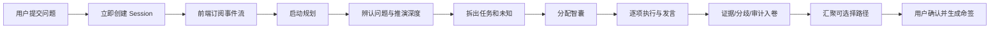

# 07 · 推演体验与事件动画设计

## 1. 要解决的问题

当前 `/start` 在服务端完成整段规划后才返回 Session。前端在此之前无法订阅事件，因此用户只能看到“起卦中”的静态画面；规划、拆题、选择智囊等真实工作虽然发生了，却没有形成体验。进入辩论后，快进又可能直接到总结，进一步隐藏中间过程。

本阶段不以“多加光效”为目标，而是让用户始终看懂：正在做什么、为什么做、谁在做、产出了什么。

## 2. 目标流程

`Session 创建` 与 `规划执行` 必须分成两个 HTTP 动作。Session 返回后立即建立 SSE，后续每个界面变化都消费真实事件。动画结束不得推进业务状态。

## 3. 信息架构

- 案卷：原问题、当前判断、已知、未知、任务及状态。
- 实况：最近事件按时间排列，显示行为、执行者、对象和结果。
- 智囊：入选原因、负责任务、运行状态、可公开发言摘要。
- 中央阵图：只表达任务、智囊、证据和分歧的关系，不承载长文本。
- 行动区：继续、补充、暂停、纠正、快进视觉、确认选择。

任何阶段即使模型调用较慢，也必须至少有一项稳定可读的信息，不能只显示循环动画。

## 4. 动画规则

| 真实事件 | 视觉动作 | 同时出现的文字 |
|---|---|---|
| `SESSION_CREATED` | 阵心点亮 | 会话已建立，正在辨认问题 |
| `PLANNING_STARTED` | 一条轨道展开 | 正在决定推演深度与任务 |
| `PLAN_CREATED` | 任务节点依次落位 | 任务名称与规划理由 |
| `UNKNOWN_IDENTIFIED` | 轨道缺口显形 | 缺少什么、为何会影响判断 |
| `AGENT_ASSIGNED` | 智囊从席位连向任务 | 入选原因与负责事项 |
| `AGENT_STARTED` | 对应节点呼吸高亮 | 正在处理的具体任务 |
| `AGENT_COMPLETED` | 结果卡进入案卷 | 可公开的一句话贡献 |
| `EVIDENCE_ACCEPTED` | 证据落卷 | 来源、时间、等级、摘要 |
| `CLAIM_CHALLENGED` | 观点间出现冲突线 | 谁挑战了什么、原因是什么 |
| `SESSION_COMPLETED` | 多条轨道收束 | 结论、条件、分歧与下一步 |

普通动作 0.4～1.2 秒，结构变化 1.5～2.5 秒。标准、减弱、关闭三档保留；快进只跳过视觉等待，不能跳过审批或隐藏结果。

## 5. 验收

提交后 1 秒内出现 Session 与可解释状态；规划期间至少显示实时状态；计划完成后能看到任务和智囊分配；执行期间能看到发言或贡献；刷新可恢复案卷但不重播动画；用户仅看界面即可复述本轮推演做过什么。
