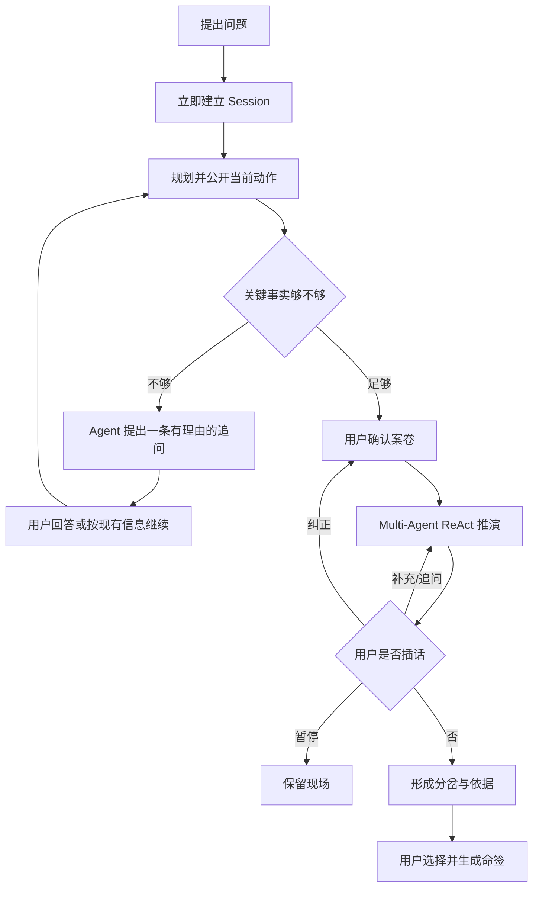

# 12 · 可中断 Multi-Agent 对话与单一交互面设计

## 1. 产品判断

推演不是“提交问题后观看系统表演”，而是一段由用户持续参与的决策对话。系统在信息不足时必须停下来问；用户在智囊工作期间必须能补充事实、纠正案卷、追问智囊或暂停。动画只解释真实状态，不替代交互。

旧版已经具备连续追问与辩论插话的体验雏形，但状态主要在浏览器、本地降级与模板层中流转。当前实现保留其交互价值，改由 Session、命令队列、ReAct 和事件流承担真实性。

## 2. 唯一用户路径

## 3. 单一交互面

输入、追问、规划实况、用户回答和辩论插话必须位于同一条对话线程。页面不得同时出现底部导航、中央输入框、左侧实况台三套操作中心。

- 始终显示原问题，避免用户忘记当前讨论对象。
- 追问同时显示“问什么”和“为什么影响判断”。
- 已回答内容留在线程中，形成多轮上下文。
- 实况默认只显示最近一次真实事件；完整任务、智囊与事件按需展开。
- 输入框在追问和推演阶段始终可达；iPad 软键盘出现后仍保留主按钮。
- 3D 阵图只在智囊执行、卦象或分岔阶段出现；输入、规划、追问、案卷确认阶段不挂载 Canvas。

原“活推演阵”作为巨型左栏没有独立操作价值，删除常驻形态。它的可追溯信息并入对话面的“查看过程”，因此信息能力保留，视觉竞争被移除。

## 4. 中断协议

前端向 `POST /api/deliberation/:sessionId/interject` 写入命令：

| 类型 | 用户含义 | Runtime 行为 |
|---|---|---|
| `SUPPLEMENT` | 补充事实 | 下一轮前并入 `questionContext`，继续 ReAct |
| `QUESTION` | 追问智囊 | 写入上下文，由演在后续轮次调度回应 |
| `CORRECTION` | 纠正错误事实 | 停止当前执行，回到案卷确认，不允许旧结论继续 |
| `PAUSE` | 暂停 | 当前安全检查点结束后进入 `PAUSED` |

命令持久化到 PostgreSQL，执行器每轮 Think 前与每批智囊完成后消费。浏览器刷新、Vercel 多实例或长请求期间，命令仍有唯一状态。命令接收和实际读入分别产生公开事件，不能用前端假消息冒充 Agent 已采纳。

## 5. Agent 主动追问

ReAct 的 `ask_user` 是正式动作，不是失败兜底。它必须返回 `state=CLARIFY`、`clarifyRequired=true` 和结构化 `askUser`；前端立即回到同一对话面的追问状态。用户回答后重新规划，已有 findings 与工具结果继续保留。

## 6. 动画边界

- Session 建立、任务生成、智囊开始/完成、用户插话被采纳、分歧与收束才触发动画。
- 等待模型时使用当前事件的稳定文字，不播放无法解释的粒子、边角扫描框或空转 Canvas。
- 常规过渡 180–420ms；结构变化不超过 800ms；reduced motion 下只保留透明度变化。
- 动画永远不能禁用输入、延迟业务请求或代替“继续”按钮。

## 7. 退出条件

1. 用户只看界面就知道当前问题、系统在做什么、下一步由谁行动。
2. Agent 可在执行中主动追问，用户能在同一位置回答并继续多轮。
3. 用户在推演中能补充、纠正、追问和暂停；纠正后旧案卷不可继续执行。
4. 小窗与 iPad 中没有常驻左栏、重复底栏或被遮挡输入框。
5. 输入、规划、追问阶段不创建 3D Canvas；所有进度来自真实事件。
