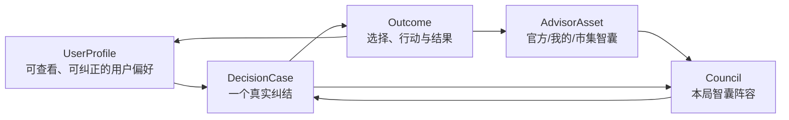
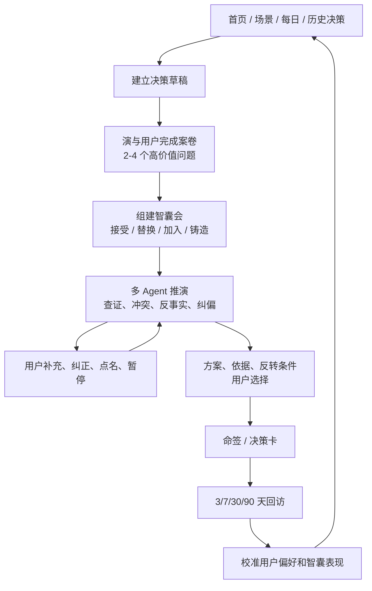

# 14 · 全产品智囊生态与决策闭环设计

> 范围：首页、场景、推演台、智囊阁、市集、命签册、日历、每日回访与社区。
> 原则：Sandbox 是一次决策的执行驾驶舱，不是整个产品。产品核心是“决策任务 + 智囊资产 + 结果回访”的长期闭环。

## 0. 执行结论

旧版不整体恢复，新 Runtime 也不继续独立生长。两者按责任合并：

| 能力 | 旧版价值 | 新 Runtime 价值 | 目标 |
|---|---|---|---|
| 智囊选择 | 推荐、我的、市集、临时上场 | 当前缺失 | 保留用户选择权，用新 Session 重做 |
| 智囊铸造 | 五步铸造有仪式感 | 后端 `custom_advisors` | 保留仪式，升级为 Agent Contract |
| 智囊市集 | 可发布、订阅，但是 localStorage 样例 | 有 `shared_agents` 骨架 | 以真实后端数据取代假市集 |
| 推演对话 | 逐位智囊可见、可追问 | 事件、恢复、所有权、ReAct | 前端取旧交互，后端只走新主链 |
| 命签和回访 | 多个页面已存在 | 事件和 Session 已可持久 | 转为决策账本与长期校准 |

产品不再用“有多少 Agent”作为卖点，而是让用户明确感知：系统知道什么、为什么选这些智囊、每位正在做什么、哪些结论有证据、哪些仍是假设，以及用户现在能做什么。

## 1. 全站四个核心对象



- `DecisionCase`：问题、目标、约束、已确认事实、系统假设、未知、证据、分支和用户承诺。
- `Council`：本局智囊、选择原因、任务、权限、预算和替换记录。
- `AdvisorAsset`：可复用的 Agent Contract，不是只有 persona 的 Prompt。
- `Outcome`：最终选择、下一步、反转条件、3/7/30/90 天结果和用户评价。

## 2. 完整用户旅程



入口页不再只是跳转：场景页产出草稿，首页能恢复未完成 Session，命签能发起复盘，日历和每日页消费真实回访任务。

## 3. 智囊会：推荐不代替用户选择

### 3.1 三种资产来源

1. **官方智囊**：经固定 Eval 的默认视角，保证稳定性。
2. **我的智囊**：用户铸造或订阅的可持久资产。
3. **智囊市集**：他人公开发布且通过基础评估的版本；可先临时试用，再订阅。

动态生成智囊默认只属于本局候选，不自动进市集。结束后用户可收入“我的智囊”，通过 Eval 后才可发布。

### 3.2 组队交互

默认只展示一个“演推荐阵容”，不使用全屏卡片墙。每个席位显示：

- 本局任务，而不只是智囊人设。
- 推荐原因与可补充的信息缺口。
- 预计耗时、是否查外部资料、最低证据级别。
- 来源：官方、我的、市集或本局新生。

用户可以：

- `接受阵容`：一次确认后立即开演。
- `替换`：只打开当前席位的同任务候选，并告知替换影响。
- `加一位`：从我的智囊或市集临时加入，标准模式不超过 6 位。
- `铸造新智囊`：保存当前 Session，铸造后返回原席位。

演是编排者，负责任务拆解、去重、推荐、覆盖与预算；但演不在用户确认前写死 Council，不用热度替代适配度，不用智囊数量冒充深度。

## 4. 智囊是 Agent Contract，不是 Persona

```ts
type AdvisorContract = {
  id: string;
  version: number;
  source: 'official' | 'owned' | 'market' | 'ephemeral';
  name: string;
  objective: string;
  perspective: string;
  methodology: string[];
  inputSchema: Record<string, unknown>;
  outputSchema: Record<string, unknown>;
  toolPolicy: { allow: string[]; deny: string[] };
  evidencePolicy: { minimumLevel: 'E0' | 'E1' | 'E2' | 'E3' | 'E4' };
  completionCriteria: string[];
  safetyBoundaries: string[];
  budget: { maxTurns: number; maxToolCalls: number; timeoutMs: number };
  evalSummary?: { sampleSize: number; helpfulRate: number; failureRate: number };
};
```

铸造台的五步仪式保留，但语义升级为：使命、方法、工具与证据、安全边界、案例试炼。用三个固定案例检查输出结构、视角重复、证据和安全，通过后才入阁。

## 5. Sandbox 作为执行驾驶舱

Sandbox 保留中央活推演阵，长文本和关键操作由 DOM 承载。四个表面是同一份 Session Event 的不同投影：

- **案卷**：事实、假设、未知、证据。
- **活推演阵**：智囊、任务、工具、冲突和收敛的结构变化。
- **演伴行线**：对话、当前问题、用户插话和操作确认。
- **过程抽屉**：事件、证据、耗时、降级和错误，默认收起。

动画必须应对真实事件。只有 `TASK_STARTED` 后才能显示智囊“正在推演”；被选中但尚未执行时，显示“已入阵·等待任务”。

## 6. 页面的产品责任

| 页面 | 用户任务 | 真实数据 | 停止伪功能 |
|---|---|---|---|
| 首页 | 开始、恢复、回访决策 | 活跃 Session、待回访 Outcome | 只展示静态 Agent 光球 |
| 场景 | 用框架建立决策草稿 | 场景模板版本、草稿 | 只跳转 `/sandbox` |
| 智囊阁 | 管理官方/我的/市集 | AdvisorAsset、Eval、订阅 | localStorage 假市集 |
| 命签册 | 查看依据、选择和反转条件 | Case、Outcome、Evidence | 只存好看的图 |
| 日历 | 看行动和回访节点 | FollowUp schedule | 虚构日历点 |
| 每日 | 轻量回访与自省 | 当天待处理 Outcome | 随机运势冒充个人结论 |
| 社区 | 明示同意后分享与发布 | 脱敏产物、发布版本 | 默认公开推演隐私 |
| 卦典 | 解释认知扰动器 | 卦象版本与作用 | 卦象冒充证据 |

## 7. 全站伴行助手

旧悬浮助手的价值是让“演”始终在场，但不能变成挡内容的大对话框。

- 默认为 44-52px 状态印，只显示活跃任务是否等待用户。
- 点开后是窄面板，只包含“继续推演、回答当前问题、查看进度”。
- 路由切换不丢 Session，但不在非 Sandbox 页面自动执行高成本任务。
- 只有等待用户回答或审批时才强调，其余时间保持安静。

## 8. 稳定性与触达

每一步都必须可证明：

- 智囊推荐保存 `recommendation_reason` 和 `coverage_delta`。
- 用户调整保存 Council 版本，不覆写旧版本。
- Agent 运行有 task start/completed/failed 事件。
- 外部结论挂 Evidence 和时间戳。
- 用户插话返回 pending/applied/rejected 和影响任务。
- 路由切换或断网按 Session Event 恢复，不重做已完成工具。

主动触达只有三类：必须补充/确认才能继续；原结论的反转条件已发生；到了用户确认的回访时间。不用“智囊想对你说”制造依赖性通知。

## 9. 分期与验收

### 9.1 比赛可体验闭环（当前必做）

1. 案卷达标后生成候选 Council，用户可确认、替换、加入。
2. 确认阵容后自动执行，不再出现第二个语义重复按钮。
3. 智囊的选中、排队、运行、查证、发现和失败有真实事件。
4. 我的智囊使用后端数据；市集上线最小真实发布/订阅，不再注入样例。
5. iPad 和小窗口可独立完成全链。

### 9.2 资产与回访（闭环后续）

- 铸造 Agent Contract 的 Eval 和版本化。
- 命签、日历、每日页消费 Outcome 与 FollowUp。
- 智囊展示个人帮助率、失败率和适用场景，不只有热度。

### 9.3 长期壁垒（数据成立后）

- 以结果回访校准用户偏好、推演策略和智囊质量。
- 建立案例回放、基线对比、版本回滚和分群 Eval。
- 用决策清晰度、行动率、后悔率、结果误差和纠正率评估，不用“卦准不准”。

### 9.4 复赛版退出条件

- 日常、职业、旅行三类问题生成不同任务和推荐阵容。
- 用户能在推荐、我的、市集中替换或增加智囊，并看见覆盖变化。
- 确认阵容后自动执行，每位智囊状态与后端事件一致。
- 用户可补充、纠正、点名、暂停和恢复，并看到指令是否生效。
- 结论包含事实、假设、证据、冲突、建议、反转条件和下一步。
- 刷新、路由切换和重连不重复执行，不丢失已回答内容。
- 1024×768 的 iPad 可完成全链，关键点击区不小于 44px。

### 9.5 止损条件

上线后若连续两轮真实测试仍无法达到：≥70% 用户不看说明完成一局；≥60% 用户能说出两位智囊做了什么；≥50% 用户记录真实下一步；主链成功率 ≥95%，则不再扩展 Agent 数量或市集。

如果用户能完成主链，但不愿回访、也不会因结果调整行动，产品上限应定位为“高完成度的沉浸式决策体验”，不再宣称个人决策操作系统。
