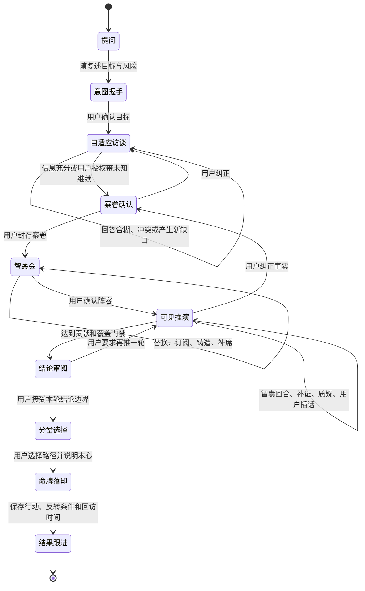

# 15 · Sandbox 自适应交互与真实多智囊舞台设计

> 范围：从用户提出问题，到案卷、智囊会、真实推演、分岔、命牌和后续跟进的完整 Sandbox 主链。
> 目标：让用户能看见系统如何理解、为什么追问、谁在工作、依据是什么，并在每个决策门禁真正参与。

## 0. 执行结论

2026-08-09 的真实 Session `sess_54f7f7fa-628a-4d9c-b8e2-4931bdca6b05` 证明当前实现不能作为复赛交付基线：饮食场景使用三个固定问题，回答“2”被当作已确认事实；演的 ReAct 首轮返回空文本后没有调用任何已选智囊，却仍用本地模板生成总结、三条路径和命牌，并标记为 `evidence-derived`。

本阶段不修补文案和遮挡，而是修复四个根规则：

1. 信息充分度由字段质量和决策影响决定，不由固定问题数量决定。
2. 推荐、选择、执行是三个不同状态，不能用同一组勾选代替。
3. 没有真实智囊贡献时，不能生成或展示“多智囊结论”。
4. 舞台、伴行助手、选择器和命牌共享一个布局系统与一个权威 Session 投影。

## 1. 经验证的失败链

| 阶段 | 当前事实 | 用户误以为 | 目标规则 |
|---|---|---|---|
| 追问 | `FOOD_FIELDS` 固定三个字段，来源为 `quick-depth-router` | LLM 正在根据回答追问 | 每次只产生一个下一最佳问题，并标明来源 |
| 答案判断 | 非空且不含少数模糊词即有效，“2”被接受 | 系统理解了“2” | 字段级解析、歧义和冲突校验 |
| 案卷 | 三项有文字即 `unknowns=[]` | 系统已收齐信息 | 已确认、系统理解、未知、冲突独立计算 |
| 智囊推荐 | Plan 的 Agent 立即写入 `selectedAgentIds` | 用户已选择且智囊已参与 | 推荐仅为候选；用户确认后才形成 Council |
| 推演 | 演空输出后直接 Reflect，0 条 finding | 多位智囊完成辩论 | 最低贡献门禁；失败时停下，不伪造成功 |
| 总结 | 饮食本地模板生成内容 | 来自本轮智囊与证据 | 每条结论必须有来源，规则回退必须明示 |
| 命牌 | 多个绝对定位组件分别展示半成品和成品 | 同一件推演产物在生成 | 只保留一个权威命牌对象和连续变形 |

## 2. 用户可理解的状态机



只有动画微步骤可以自动播放。状态图中的每一条跨阶段边都需要用户操作或明确授权的自动模式。

## 3. 自适应访谈

### 3.1 信息字段

```ts
type InformationField = {
  id: string;
  label: string;
  value: string | null;
  status: 'open' | 'ambiguous' | 'conflicted' | 'answered' | 'skipped' | 'confirmed';
  source: 'user' | 'rule' | 'model' | 'memory' | 'tool';
  questionSource?: 'rule-gate' | 'model-interviewer' | 'advisor';
  reason: string;
  decisionImpact: string;
  confidence: number;
  dependsOn: string[];
};
```

服务端每轮只返回一个 `nextQuestion`，同时返回全部字段的状态。下一问可以依赖上一问；新答案可以新增字段、使旧字段失效或触发深度升级。

### 3.2 答案质量

答案必须经过字段级验证：

- `body_signal` 必须能映射为饥饿、嘴馋、饱胀、无食欲、不适或带量表的强度。
- 裸数字只有在问题明确提供量表时才可直接接受，否则标记 `ambiguous`。
- `meal_context` 至少需要时间或餐量之一；缺少另一项时保留为未知，而不是伪造完整。
- 跳过代表用户授权保留未知，不代表字段已回答。
- 新答案与已确认事实冲突时，先要求用户纠正案卷，不能自动覆盖。

### 3.3 停止条件

`readiness` 不再只有计数，而是：

```ts
type CaseReadiness = {
  status: 'collecting' | 'review' | 'blocked' | 'confirmed';
  coverage: number;
  unresolvedAmbiguities: string[];
  unresolvedConflicts: string[];
  openRequiredFields: string[];
  authorizedUnknowns: string[];
  reason: string;
};
```

满足以下条件才进入案卷确认：必需字段已回答或明确跳过；没有未处理歧义；没有关键冲突；风险边界已确认。用户可随时选择“带着这些未知继续”，系统必须把未知带入后续结论。

### 3.4 用户看到什么

每次追问展示：问题、来源、为什么问、将改变哪个判断。回答后先展示演的单句理解，用户可点“理解不对”立即纠正。侧栏提供“查看全部缺口”，但默认只展示当前一个问题。

## 4. 案卷不是结果页

案卷使用四栏语义而不是三个空计数：

1. **你确认的事实**：用户原话和已接受工具事实。
2. **演的理解**：模型推断、置信度和依据，可逐项纠正。
3. **仍未知**：明确说明未知会限制什么。
4. **冲突与风险**：互相矛盾的事实和需要优先处理的边界。

“系统理解 0、未知 0”不能作为空状态。若没有推断，应显示“演尚未添加额外理解”；若未知为空，必须由 readiness 说明为何足够。

## 5. 智囊会

### 5.1 推荐、选择、执行三态

```ts
type CouncilSeat = {
  advisorId: string;
  state: 'recommended' | 'selected' | 'queued' | 'running' | 'completed' | 'failed';
  task: string;
  reason: string;
  coverageDelta: string[];
  source: 'official' | 'owned' | 'market' | 'ephemeral';
  failure?: { code: string; message: string };
};
```

推荐智囊默认不勾选。用户可以一键接受推荐，也可以逐席替换。只有 Council 确认后才出现 `queued`，只有收到 `AGENT_STARTED` 才显示“正在推演”。

### 5.2 四个候选入口

- 演推荐：按当前案卷缺口、任务和覆盖增量排序。
- 全部官方：完整官方 Catalog，不只展示本轮推荐的三位。
- 我的智囊：自建和已订阅资产。
- 市集：真实发布资产；为空时说明当前无公开资产，不注入样例。

### 5.3 铸造与返回

打开铸造台前保存 `sessionId`、`seatId`、缺失视角和建议 Contract。完成后通过 `/sandbox?resume=<sessionId>&seat=<seatId>&advisor=<advisorId>` 返回，恢复案卷和 Council 草稿，并把新智囊放入原席位。用户可以把演建议的临时智囊用于本局，也可以正式铸造为长期资产。

## 6. 真正的多智囊执行门禁

### 6.1 最低成功条件

进入结论审阅前必须满足：

- 至少一位用户确认的智囊产生合法 finding；标准和深度推演至少两位。
- 每个 finding 包含 `claim`、`reasoning`、`assumptions`、`evidenceRefs`、`confidence`、`reversalConditions`。
- Planner 要求的关键视角有贡献，或明确保留为 gap。
- 所有失败 Agent 有公开失败事件和可替换入口。

若演的 Think 为空、JSON 非法或没有产生 `advisor_call`，Runtime 不能进入 Reflect。它应先执行受控的“逐位调用已确认智囊”降级；若仍没有 finding，则返回 `DELIBERATION_BLOCKED`，由用户重试、换模型、替换智囊或选择明示的规则快答。

### 6.2 可见回合

一个回合由以下真实事件组成：

1. 演发布任务令。
2. 智囊开始。
3. 智囊提交主张或失败。
4. 证据工具开始与完成。
5. 另一智囊质疑、补充或确认。
6. 演显示阶段性共识、分歧和缺口。
7. 系统停下等待用户继续、追问、补充、纠正或换人。

用户可开启自动播放，但这是用户设置，不是默认状态。自动播放在每个回合结束时仍保留暂停点。

### 6.3 结论和选项溯源

```ts
type DecisionOption = {
  id: string;
  label: string;
  summary: string;
  source: 'agent-evidence' | 'model-synthesis' | 'rule-fallback' | 'user-authored';
  findingIds: string[];
  evidenceIds: string[];
  assumptions: string[];
  reversalConditions: string[];
};
```

`agent-evidence` 只有在 `findingIds` 可解析且所引 finding 存在时才合法；若结论涉及外部事实，相应 `evidenceIds` 也必须可解析。规则回退必须显示“规则快答”，不能展示智囊头像、辩论总结或卦象证据。

## 7. 统一舞台与伴行助手

### 7.1 一个布局系统

Sandbox 使用 CSS Grid 预留区域：

```css
.sandbox-shell {
  display: grid;
  grid-template-columns: minmax(0, 1fr) clamp(340px, 32vw, 420px);
  grid-template-rows: auto minmax(0, 1fr) auto;
  grid-template-areas:
    "steps steps"
    "stage companion"
    "action action";
}
```

舞台、伴行助手和底部操作不再各自使用固定定位争夺视口。弹层仅用于短确认，不承载完整案卷、智囊目录或命牌正文。

### 7.2 浮空内容层

中央罗盘保留为氛围和关系图，真实文字使用 DOM 卡片叠加在舞台容器内。卡片由 Session Event 驱动，可显示任务令、主张、证据、质疑、用户插话和阶段收束。内容可滚动、可复制、可被辅助技术读取，不把长文本绘制到 Canvas。

### 7.3 iPad 和小窗口

- 横屏宽度大于 899px：舞台与伴行栏并排。
- 竖屏或小于 900px：伴行栏变为底部 Sheet，最大高度 `42dvh`。
- 所有主操作位于布局中的 action 区，不覆盖舞台内容。
- 触控目标不小于 44×44px；软键盘打开后当前问题和提交按钮仍可见。
- 1024×768、1180×820、768×1024 为发布前必测视口。

## 8. 单一权威命牌

命牌从 `DecisionArtifact` 的同一个 React 组件逐步变化：

1. `deliberating`：承载当前主张和分歧。
2. `options`：展示可追溯分岔。
3. `selected`：翻面显示用户选择和待补充本心。
4. `committed`：展开卦象镜头、行动、反转条件和回访时间。

删除同时存在的右侧半成品面板、中央命牌和左侧天命锦书。易经映射只能消费已确认案卷、finding、冲突和选择，不能补写事实或替代证据。

## 9. 事件和监测

新增或收敛以下公开事件：

- `QUESTION_PROPOSED / ANSWER_INTERPRETED / ANSWER_REJECTED`
- `CASE_READINESS_CHANGED / CASE_CONFIRMED`
- `COUNCIL_PROPOSED / COUNCIL_CONFIRMED / COUNCIL_REVISED`
- `ROUND_STARTED / ADVISOR_SPEAK / ADVISOR_FAILED / ROUND_AWAITING_USER`
- `CONCLUSION_BLOCKED / CONCLUSION_READY`
- `OPTION_PROVENANCE_ATTACHED / DECISION_COMMITTED`
- `ARTIFACT_REVEALED / FOLLOW_UP_SCHEDULED`

生产监测至少包含：答案歧义率、平均追问轮数、用户带未知继续率、Council 调整率、Agent 成功率、0 finding 阻断率、结论溯源完整率、各语义门禁停留时间、恢复成功率和全链完成率。

## 10. 复赛退出条件

- “2”不会被当作 `body_signal` 已确认事实。
- 后一问可依赖前一问；追问数量不固定。
- 用户能看到问题来源、系统理解、未知和冲突。
- 推荐智囊不会自动变成已选择；完整官方、市集、我的智囊均可访问。
- 铸造完成后能恢复原 Session 和席位。
- 每位完成智囊都有真实公开 finding；失败明确显示。
- 0 finding 时不生成多智囊总结、动态选项或命牌。
- 每个选项可追溯到 finding、证据或明示规则回退。
- 用户可以在每轮推演后补充、纠正、追问、换人和继续。
- 关键阶段不自动跨越；页面刷新后恢复在同一语义门禁。
- 三个目标视口无内容遮挡、截断和不可达操作。
- 全流程只生成一个权威命牌对象。

达到以上条件后才能进入 Vercel 后端和 Surge 前端部署验收。
