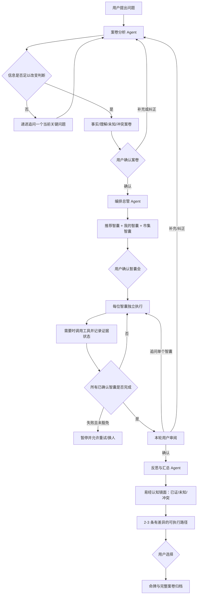

# 00｜重构总览与系统边界

## 1. 产品定义

Sandbox 不是“把多个提示词同时发给模型”的辩论页，而是一条可中断、可追溯、由用户掌握最终决定权的多 Agent 决策链。系统负责理解问题、识别未知、编排智囊、查证信息、保存分歧和生成可执行路径；用户负责确认事实、选择智囊、纠正上下文与提交选择。

## 2. 当前主链

## 3. 能力边界

- 模型输出不是事实。用户原话、可信工具结果、模型推断分别存放。
- 易经不是预测器。六爻映射的是六个审查视角的知识状态，用于暴露未知、冲突和反转条件。
- 市场价格、政策、行情等时效信息必须经真实工具查证；搜索建议和结果数量不能作为证据。
- 标准推演必须取得每位已确认智囊的独立贡献；缺席智囊不能被其他模型的输出冒充。
- 补充和纠正会停止当前轮并重新分析案卷；不会带着错误上下文继续自动推演。

## 4. 生产级结论

当前实现已具备生产级主链的结构和可测试闭环，但仍属于复赛体验版，不应宣称为无人监管的高风险决策系统。医疗、法律、投资等场景必须增加专业数据源、免责声明和人工升级机制。
